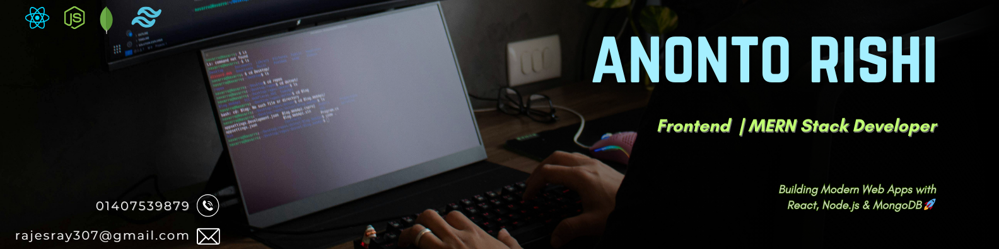

<h1 align="center">Anonto Rishi</h1>
<h3 align="center">Full Stack MERN Developer | React Specialist | Building Scalable Web Applications</h3>

  

---

### 

I am a passionate **Full Stack MERN Developer** focused on building modern, secure, and scalable web applications[cite: 1].  
I enjoy transforming ideas into real-world products using **React, Node.js, and MongoDB**[cite: 1].  
Currently, I am sharpening my skills through hands-on projects and real-world implementations[cite: 1].

---

### 

- Working on advanced MERN projects with **Stripe payment integration**[cite: 1]
- Exploring **Next.js & Cloud Deployment**[cite: 1]
- Improving backend architecture & REST API security[cite: 1]
- **Goal:** Become a production-level full-stack engineer[cite: 1]

---

### 

- **Email:** rajesray307@gmail.com[cite: 1]
- **Phone:** +8801407539879[cite: 1]
- **Location:** Mymensingh, Netrakona, Bangladesh[cite: 1]

---

### 

  
  
  

---

## 

### Frontend

### Backend & Database

### Authentication & Payments

### Tools & Deployment

---

## 

### Aura Botanical Archive (Full-Stack Luxury E-Commerce)
An elite e-commerce architecture for premium botanical aesthetics, powered by React 19, Express, Node.js, and Gemini AI Visual Search[cite: 1].

- **Live:** https://aura-botanical-project.vercel.app[cite: 1]
- **Repository:** https://github.com/rajes124/Aura-botanical-Project

---

### Student Life Lessons (MERN + Stripe)
A premium learning & community platform with role-based dashboard and secure payments[cite: 1].

- **Live:** https://student-life-lessons.web.app[cite: 1]
- **Client Code:** https://github.com/rajes124/Student-life-lessons-Clint-side[cite: 1]  
- **Server Code:** https://github.com/rajes124/Lessons-backend[cite: 1]  

---

### Tech Gadget Import–Export Hub
E-commerce management system with authentication and private routing[cite: 1].

- **Live:** https://thriving-dragon-b31ec0.netlify.app[cite: 1]  
- **Client Code:** https://github.com/rajes124/Tech-Gadget-Client-side[cite: 1]  
- **Server Code:** https://github.com/rajes124/Back-end-server[cite: 1]  

---

### GreenNest – Indoor Plant Store
Responsive React application with Firebase authentication[cite: 1].

- **Live:** https://fascinating-torte-32ae71.netlify.app[cite: 1]  
- **Repository:** https://github.com/rajes124/Home-Dec[cite: 1]  

---

## 

  

  

  

---

  <b>Open to Internship & Junior Developer Opportunities</b>  
  Let’s build something impactful together!

